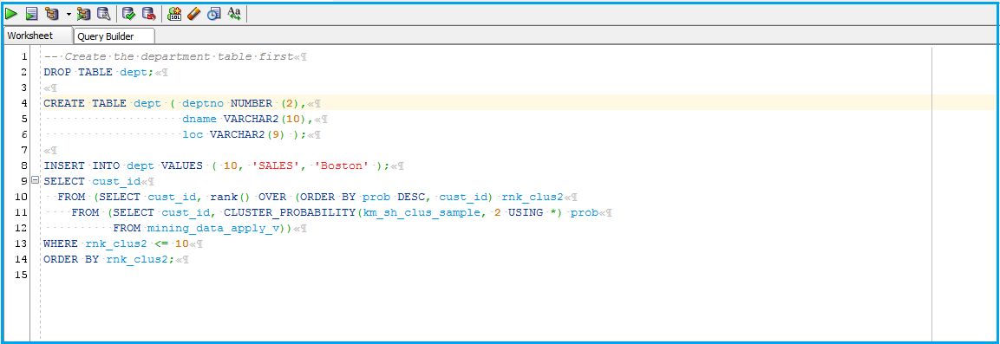
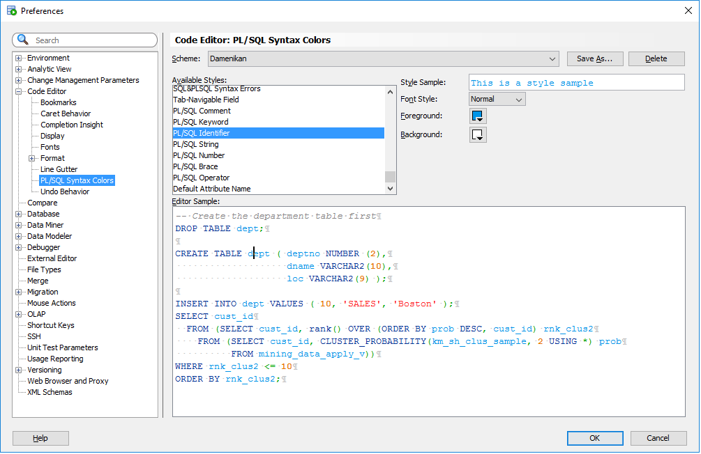

#Colour scheme for Oracle SQL Developer #

This is colour scheme for Oracle SQL Developer.

## Installation ##

Unfortunately Oracle doesn't make it easy to import a new colour scheme into SQL Developer, thus a little bit of hacking is required.

- Close SQL Developer. This is important. If you modify the scheme file while SQL Developer is open, your changes won't be saved.

- Locate file `dtcache.xml` in the SQL Developer's settings directory. On my system it is located in directory `C:\Users\sergey\AppData\Roaming\SQL Developer\system4.0.3.16.84\o.ide.12.1.3.2.41.140908.1359`

- Locate `<schemeMap>` tag inside dtcache.xml file. Insert the content of [`color_scheme.xml`](https://github.com/SiarheiDamenikan/sqldeveloper/blob/master/plsql_syntax_color/color_scheme.xml) file inside `<schemeMap>` alongside the other colour schemes. Be careful not to break the XML.

- Launch SQL Developer. Navigate to menu Tools->Preferences, then select item Code Editor -> PL/SQL Syntax Colours in the left pane.

- Select "OzBsidian" in the "Scheme" drop down list on the top.

